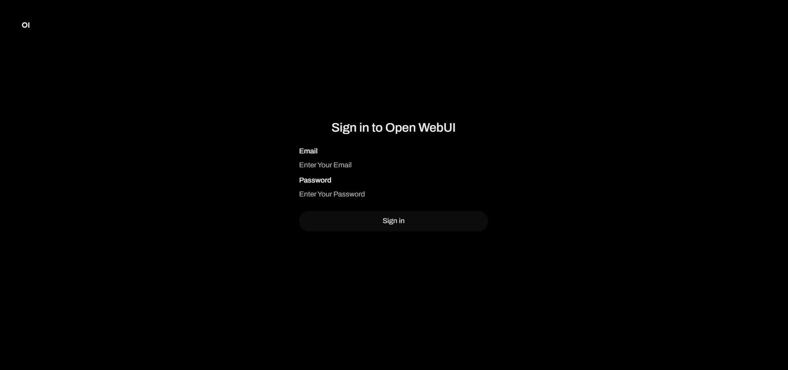
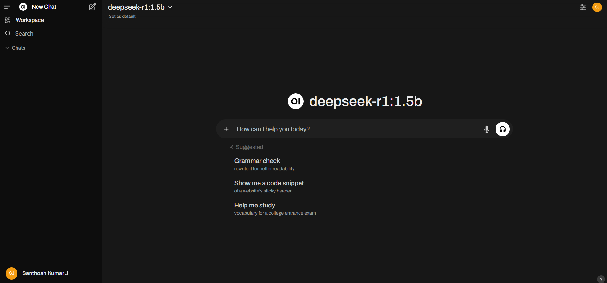
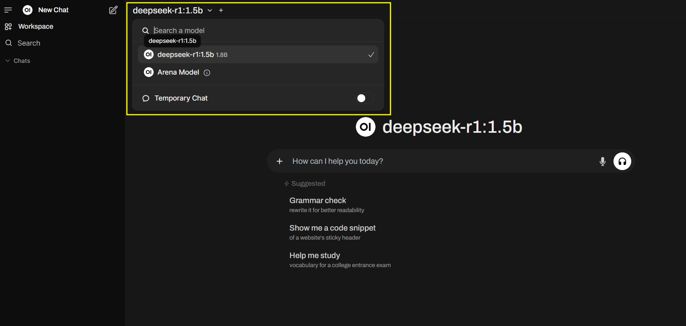

# Deepseek Chatbot Setup on Windows WSL2 with Docker, Ollama, and OpenWebUI using Nvidia GPU

This guide provides step-by-step instructions to set up a Deepseek chatbot on Windows WSL2 using Docker, Ollama, and OpenWebUI. The setup includes GPU acceleration using the CUDA Toolkit. By the end of this guide, you will have a fully functional chatbot hosted locally on your machine.

--- 
### Prerequisites
- [x] Windows 10/11 (64-bit)
- [x] WSL2 (Windows Subsystem for Linux 2)
- [x] NVIDIA GPU with CUDA support
---

##### Step 1: Install WSL2
- Enable WSL2 - Open *PowerShell* as Administrator and run:
    ```
    wsl --install
    ```
    This installs WSL2 and a default Linux distribution (e.g., Ubuntu).
- Set WSL2 as Default - Run the following command to ensure WSL2 is the default version:
    ```
    wsl --set-default-version 2
    ```
- Install a Linux Distribution - If not already installed, install a distribution like Ubuntu from the Microsoft Store. (I recommend using Ubuntu 22.04 for guaranteed cuda support)

##### Step 2: Install CUDA Toolkit for GPU Support
- Install NVIDIA Drivers - Download and install the latest NVIDIA drivers for your GPU from the [NVIDIA website](https://developer.nvidia.com/cuda-downloads). Select Wsl2 platform in the configuration options shown.
- Install CUDA Toolkit - Download the CUDA Toolkit from the NVIDIA CUDA Toolkit website.
    - Follow the installation instructions for Windows.
    - Verify CUDA Installation - Open a terminal in WSL2 and run `nvcc --version`. This should display the installed CUDA version.
    - Install NVIDIA Container Toolkit - follow the instruction from this [official Nvidia guide](https://docs.nvidia.com/datacenter/cloud-native/container-toolkit/latest/install-guide.html).
        - Configure the production repository
            ```
            curl -fsSL https://nvidia.github.io/libnvidia-container/gpgkey | sudo gpg --dearmor -o /usr/share/keyrings/nvidia-container-toolkit-keyring.gpg \
            && curl -s -L https://nvidia.github.io/libnvidia-container/stable/deb/nvidia-container-toolkit.list | \
                sed 's#deb https://#deb [signed-by=/usr/share/keyrings/nvidia-container-toolkit-keyring.gpg] https://#g' | \
                sudo tee /etc/apt/sources.list.d/nvidia-container-toolkit.list
            ```
        - Update the packages list from the repository:
            ```
            sudo apt-get update
            ```
        - Install the NVIDIA Container Toolkit packages:
            ```
            sudo apt-get install -y nvidia-container-toolkit
            ```
        - Configure the container runtime by using the nvidia-ctk command:
            ```
            sudo nvidia-ctk runtime configure --runtime=docker
            ```
        - Restart the Docker daemon:
            ```
            sudo systemctl restart docker
            ```

##### Step 3: Install Docker on WSL2
- Install Docker is simple either follow the steps from the [official website](https://docs.docker.com/engine/install/ubuntu/) or by following the below steps. (I recommend installing only the docker engine rather than install the whole docker desktop since it's not opensourced yet)
    - Run the following commands in your WSL2 terminal to uninstall all conflicting packages:
        ```
        for pkg in docker.io docker-doc docker-compose docker-compose-v2 podman-docker containerd runc; do sudo apt-get remove $pkg; done
        ```
    - Set up Docker's apt repository.
        ```
        # Add Docker's official GPG key:
        sudo apt-get update
        sudo apt-get install ca-certificates curl
        sudo install -m 0755 -d /etc/apt/keyrings
        sudo curl -fsSL https://download.docker.com/linux/ubuntu/gpg -o /etc/apt/keyrings/docker.asc
        sudo chmod a+r /etc/apt/keyrings/docker.asc

        # Add the repository to Apt sources:
        echo \
        "deb [arch=$(dpkg --print-architecture) signed-by=/etc/apt/keyrings/docker.asc] https://download.docker.com/linux/ubuntu \
        $(. /etc/os-release && echo "${UBUNTU_CODENAME:-$VERSION_CODENAME}") stable" | \
        sudo tee /etc/apt/sources.list.d/docker.list > /dev/null
        sudo apt-get update
        ```
    - Install the Docker packages.
        ```
        sudo apt-get install docker-ce docker-ce-cli containerd.io docker-buildx-plugin docker-compose-plugin
        ```
    - Verify that the installation is successful by running the hello-world image:
        ```
        sudo docker run hello-world
        ```
    - if it asks you to sudo everytime whenever you're using docker command then run the following command to add docker to sudo users.
        ```
        sudo usermod -aG docker $USER
        ```
    
##### Step 4: Install Ollama
- Simply install ollama in wsl2 using the command 
    ```
    docker run --rm --gpus=all -d -v olama_data:/root/.ollama -p 11434:11434 --name ollama ollama/ollama
    ``` 
    or follow the latest instructions from the [official website](https://hub.docker.com/r/ollama/ollama).
- To pull a Language Model (e.g., llama2, deepseek) browse the [official model page](https://ollama.com/search) from ollama and run the appropriate command. 
    ```
    # To pull the complete DeepSeek-R1 model (But I recommend starting from the base models like deepseek-r1:1.5b)
    docker exec ollama ollama run deepseek-r1:671b
    ``` 

##### Step 5: Set Up OpenWebUI
- Simply use the following docker command to pull the image and run it. You can also follow the [official guide](https://github.com/open-webui/open-webui) if you want.
    - To run Open WebUI with Nvidia GPU support, use this command:
        ```
        docker run -d -p 3000:8080 --gpus all --add-host=host.docker.internal:host-gateway -v open-webui:/app/backend/data --name open-webui --restart always ghcr.io/open-webui/open-webui:cuda
        ```
    - To run Open WebUI with CPU, use this command:
        ```
        docker run -d -p 3000:8080 --add-host=host.docker.internal:host-gateway -v open-webui:/app/backend/data --name open-webui --restart always ghcr.io/open-webui/open-webui:main
        ```
    - Access OpenWebUI - Open your browser and navigate to http://localhost:3000. You should see the OpenWebUI interface.
        
    - If you login for the first time it will ask you to create a user account for Open WebUI, so use whatever you want and sign in.
         
    - Now select the model from the top left as shown below and you're good to go.
        
        
##### Troubleshooting
- WSL2 GPU Issues - Ensure your NVIDIA drivers and CUDA Toolkit are correctly installed. 
- Verify GPU support in WSL2 by running: `nvidia-smi` or `nvcc --version`
- If you encounter permission issues, ensure your user is added to the docker group and restart WSL2.
- Ollama Errors - Ensure Ollama is running and the model is downloaded correctly.

### Conclusion
You now have a fully functional Deepseek chatbot running on Windows WSL2 with GPU acceleration using Docker, Ollama, and OpenWebUI. This setup allows you to experiment with large language models and host a chatbot client locally. Enjoy exploring the capabilities of your chatbot! 🚀